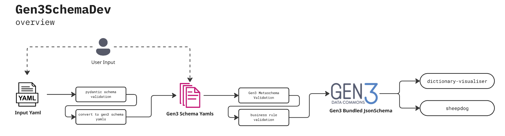

# Developing a Gen3 Data Dictionary



This repository aims to provide the documentation, learning materials, and software tools to facilitate the creation of a data model in Gen3.

[Github Repo](https://github.com/AustralianBioCommons/gen3schemadev)

***Pre-Reading**: Please become familiar with some [core data modelling concepts](docs/core_concepts/pre_reading.md) before starting.*


## Using Gen3SchemaDev as a data modelling tool
- [Quickstart](docs/gen3schemadev/quickstart.md)
- [Guide to creating your first dictionary](docs/gen3schemadev/first_dictionary.md)
- [Troubleshooting](docs/gen3schemadev/troubleshooting.md)


## Deep dive into Gen3 Data Modelling
*Special Thanks to Marion Shadbolt for providing the [source material](https://github.com/AustralianBioCommons/umccr-dictionary/tree/main/docs/schemas)*
1. [Gen3 Dictionary Overview](docs/gen3_data_modelling/dictionary_structure.md)
1. [Gen3 Schema Explained](docs/gen3_data_modelling/schemas.md)
   1. [Descriptors](docs/gen3_data_modelling/descriptors.md)
   2. [Links](docs/gen3_data_modelling/links.md)
   3. [Properties](docs/gen3_data_modelling/properties.md)
2. [Example of a Gen3 Schema yaml](docs/gen3_data_modelling/explainer_schema.yaml)
3. [Handy tips](docs/gen3_data_modelling/handy_tips.md)
4. [FAIR Concepts for Data Modelling](docs/core_concepts/fair.md)

## For Developers

### Installation and testing
```bash
# To install
pip install poetry
poetry install
source $(poetry env info --path)/bin/activate
gen3schemadev --version

# To run tests
poetry run pytest
```

### Contributing
Gen3SchemaDev is an open source project, and we highly encourage any contributions and PRs. Specifically we need the community to help with the following:
1. Keeping the [gen3 metaschema](src/gen3schemadev/schema/schema_templates/gen3_metaschema.yml) up to date 
2. Adding business rule logic to the [rule validator](src/gen3schemadev/validators/rule_validator.py) module. 
   1. For example, a node with the category `data_file` should have a collection of required data file properties such as md5sum, filesize, etc.

For PRs, please follow the [contributing guidelines](CONTRIBUTING.md).

## License
[Apache 2.0](LICENSE)

