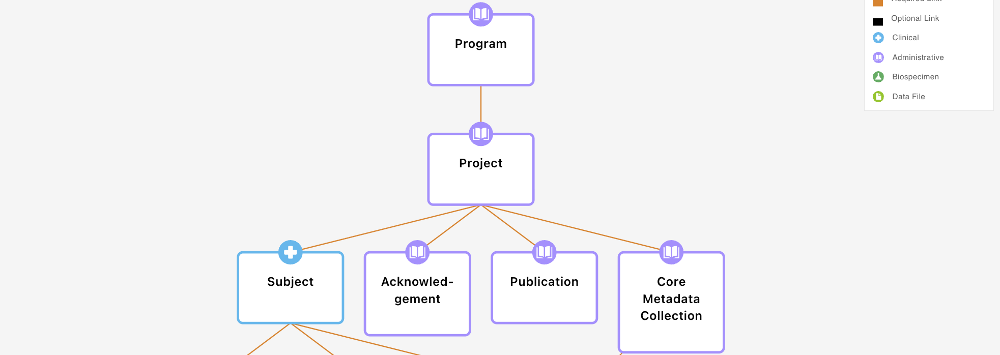
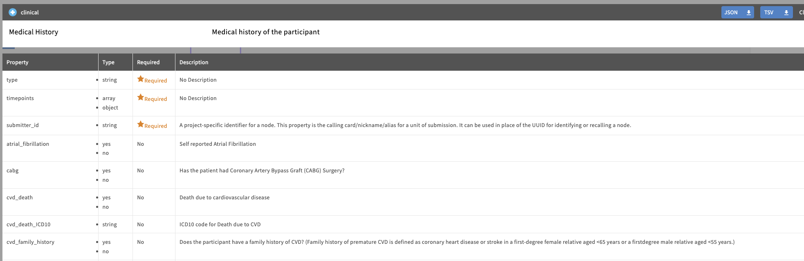

# Core Principles to Data Modelling

## Table of Contents
Data modelling in Gen3SchemaDev focuses on the following core concepts:
- [Core Principles to Data Modelling](#core-principles-to-data-modelling)
  - [Table of Contents](#table-of-contents)
- [nodes](#nodes)
- [Properties](#properties)
  - [Data types](#data-types)
  - [Enums](#enums)
- [Links](#links)
  - [Example:](#example)
    - [Example 1](#example-1)
    - [Example 2](#example-2)
- [Lets make a Gen3 Data Dictionary!](#lets-make-a-gen3-data-dictionary)

---

# nodes
An entity represents a table of data in the data model. nodes encapsulate related information, for example, information about the patient, the sample, sequencing run, output files, etc. When data is submitted to the data model, each table of metadata will correspond to a specific entity. 

The example below shows the nodes `program`, `project`, `subject`, `acknowledgement`, `publication`, and `core_metadata_collection`.

# Properties
Properties are found within nodes. Properties can be thought of as the columns in a table. Each properties will have the property name (column name), a description of what the property is, and a data type. 

## Data types
| Data Type  | Description                                      | Example Value         |
|------------|--------------------------------------------------|----------------------|
| string     | Textual data                                     | "sample123"          |
| integer    | Whole numbers                                    | 42                   |
| number     | Numeric values (integer or floating point)        | 3.14                 |
| boolean    | True or false values                             | true                 |
| object     | Key-value pairs (dictionary/map)                  | {"age": 30}          |
| array      | Ordered list of values                           | [1, 2, 3]            |
| null       | Null value (no value)                            | null                 |

*These are the standard [JSON Schema data types](https://json-schema.org/understanding-json-schema/reference/type.html) used to define the kind of data a property can hold.*
  

## Enums
In a `property`, a specific data type called an enumeration (`enum`) can be used to specify a set of allowed values, like a controlled vocabulary. `Enums` are an `array` data type, where each value in the array is an allowed value. 

For example, a property that specifies the experiment type could be defined as: `['RNAseq', 'ChIPseq', 'LC-WGS', 'WES', 'WGS']`.

# Links
Links are used to connect nodes together. Links are directional, always connecting a child entity up to its parent. 

Importantly, links have a `multiplicity`, which can be one of: 
- `one_to_one`
- `one_to_many`
- `many_to_one`
- `many_to_many`

## Example:

The example below shows some properties from the `medical_history` entity. Notice how the first column is the property name, the second column is the data type, the third whether the property is required or not, and the fourth is the description.

- Some properties, like `atrial_fibrillation`, can only accept a specific set of values. In this case, the only allowed values are `yes` or `no`. This is an example of a controlled vocabulary, which we define using an `enum`.

---

### Example 1
> Use case: "Each patient may have multiple blood samples taken, but information about mortality will always be one record per patient."

How would we define these links?

First, lets define the `nodes`:
- `patient`
- `blood_sample`
- `mortality`

Then, lets define the `links`:
- `patient` -> `one_to_many` -> `blood_sample`
- `blood_sample` -> `one_to_one` -> `mortality`

---

### Example 2
> Use case: "Multiple samples are loaded into a mass spectrometry machine each run, which produces a batch of mass spectrometry data files. However, all the data files from every mass spectrometry run are analysed with a single lipidomics workflow."

Lets define the `nodes`:
- `sample`
- `mass_spectrometry_run`
- `mass_spectrometry_data_file`
- `lipidomics_workflow`

Then, lets define the `links`:
- `sample` -> `many_to_one` -> `mass_spectrometry_run`
- `mass_spectrometry_run` -> `one_to_many` -> `mass_spectrometry_data_file`
- `mass_spectrometry_data_file` -> `many_to_one` -> `lipidomics_workflow`

---

# Lets make a Gen3 Data Dictionary!
- Follow this guide on how to use Gen3SchemaDev to create your first dictionary: [Creating your first dictionary](..//gen3schemadev/first_dictionary.md)