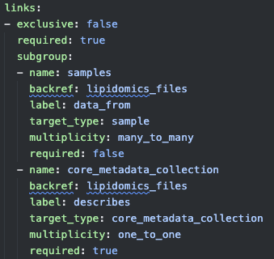

# Descriptors

| schema key             | description                                                                                 | required user input | specificity | default value                                                     | data type                                                                                                                     | yaml example                       |
|------------------------|---------------------------------------------------------------------------------------------|---------------------|-------------|-------------------------------------------------------------------|------------------------------------------------------------------------------------------------------------------------------|-------------------------------------|
| `id`                   | Unique identifier for the entity                                                            | yes                 | jsonschema  | n/a                                                               | String                                                                                                                       | lipidomics_file                     |
| `title`                | Name of the entity                                                                          | yes                 | jsonschema  | n/a                                                               | String                                                                                                                       | Lipidomics File                     |
| `category`             | Classification of entity                                                                    | yes                 | gen3        | n/a                                                               | Enum ['administrative', 'index_file', 'biospecimen', 'clinical', 'notation', 'data_file', 'analysis', 'experimental_methods'] | data_file                           |
| `description`          | Description of the schema                                                                   | yes                 | jsonschema  | n/a                                                               | String                                                                                                                       | Data file containing lipidomics data |
| `links`                | Array of objects that describe links to other entities                                      | yes                 | gen3        | n/a                                                               | Array                                                                                                                        |                   |
| `required`             | Array listing the property names that must be present in a valid json object                | yes                 | jsonschema  | ['type', 'submitter_id', 'core_metadata_collection']               | Array                                                                                                                        |                |
| `type`                 | Data type for the entity                                                                    | no                  | jsonschema  | object                                                            | String                                                                                                                       | object                              |
| `namespace`            | Namespace                                                                                   | no                  | gen3        | n/a                                                               | String                                                                                                                       | http://commons.heartdata.baker.edu.au/ |
| `program`              | Program the schema belongs to                                                               | no                  | gen3        | *                                                                 | String                                                                                                                       | *                                   |
| `project`              | Project the schema belongs to                                                               | no                  | gen3        | *                                                                 | String                                                                                                                       | *                                   |
| `additionalProperties` | A boolean that controls whether properties not explicitly defined in properties are allowed | no                  | jsonschema  | False                                                             | Bool                                                                                                                         | False                               |
| `submittable`          | Can you submit data to this entity?                                                         | no                  | gen3        | True                                                              | Bool                                                                                                                         | True                                |
| `validators`           | Custom field to hold validation logic                                                       | no                  | gen3        | None                                                              | String                                                                                                                       | None                                |
| `systemProperties`     | A list of gen3 specific properties                                                          | no                  | gen3        | ['id', 'project_id', 'state', 'created_datetime', 'updated_datetime'] | Array                                                                                                                        |                |
| `uniqueKeys`           | Properties in the entity that will be used for unique identification                        | no                  | gen3        | [['id'], ['project_id', 'submitter_id']]                          | Array                                                                                                                        |                  |


## Unique Keys

A set of `uniqueKeys` must be specified. This provides a way of uniquely identifying any node. 

note:
{: .label .label-yellow }

Am yet to come accross an example other than the one below. Not sure about the exact function of this field.

Example from `study.yaml`

```yaml
uniqueKeys:
  - [id]
  - [project_id, submitter_id]
```