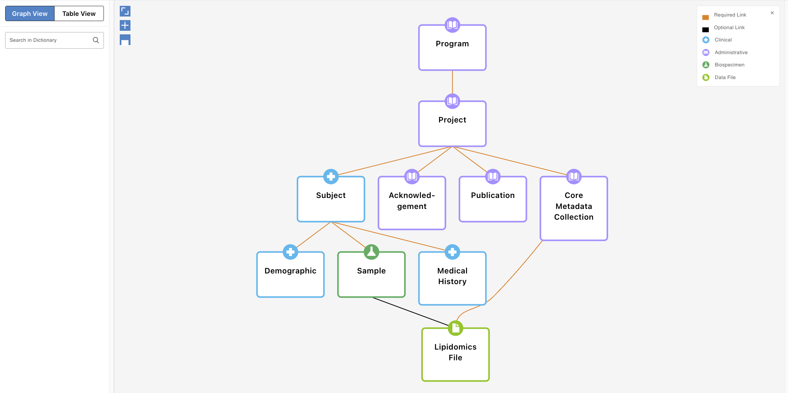

# Dictionary Structure
The gen3 data dictionary is a graph based data model, where the nodes represent entities and the edges represent relationships between the entities. Each entity is defined by a `schema` which is represented in [yaml format](explainer_schema.yaml). Therefore, an entire data dictionary can be defined by a [folder containing multiple yaml files](../../examples/schema/yaml/).

To load the data dictionary into the gen3 system, the yaml files must be converted into json format, and then bundled into a list of jsonschemas which are saved to a single json file ([example](../../examples/schema/json/gen3_bundled_schema.json.json)). This json file is called a `Gen3 Bundled Schema`, and is uploaded to `sheepdog` to deploy the data model.

**Summary definitions**
- `Gen3 Data Dictionary`: A folder containing multiple yaml files for each entity in the data model.
- `Gen3 Schema`: A single yaml or json file that defines a single entity in the data model. [Learn More](schemas.md)
- `Gen3 Bundled Schema`: A json file containing a list of jsonschemas for each entity in the data model.

## Required entities

All dictionaries must have the following schemas as part of the dictionary structure:
- `Program`
- `Project`
- `Core Metadata Collection`

While properties may be edited within these, the `dbgap` associated fields on the projects cannot be removed.

In addition, all data files need to be linked to the `core_metadata_collection`.

## Visual Example
- The files that created this example can be found [here](../../examples/schema/).

## What's next?
Now lets take a look at a [Gen3 Schema](schemas.md).