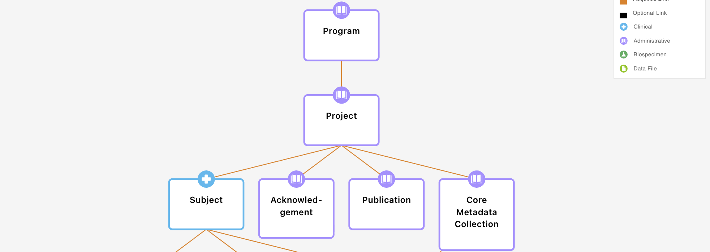

# Creating your first gen3 data dictionary

## Table of Contents
- [Creating your first gen3 data dictionary](#creating-your-first-gen3-data-dictionary)
  - [Table of Contents](#table-of-contents)
  - [Pre-requisites](#pre-requisites)
  - [Introduction](#introduction)
  - [Gen3 `input_yaml` file](#gen3-input_yaml-file)
  - [1. Adding Version and URL](#1-adding-version-and-url)
  - [2. Nodes](#2-nodes)
    - [2.1 Defining the nodes](#21-defining-the-nodes)
    - [2.2 Adding the node category](#22-adding-the-node-category)
    - [2.3 Adding the node description](#23-adding-the-node-description)
  - [3. Properties](#3-properties)
    - [3.1 Adding the properties](#31-adding-the-properties)
    - [3.2 Adding properties with enums](#32-adding-properties-with-enums)
  - [4. Links](#4-links)
    - [4.1 Defining the links](#41-defining-the-links)
    - [4.2 Adding multiple links to the same node](#42-adding-multiple-links-to-the-same-node)
  - [5. The completed input YAML file](#5-the-completed-input-yaml-file)
    - [6. Converting the input\_yaml to a folder containing the `Gen3 Data Dictionary`](#6-converting-the-input_yaml-to-a-folder-containing-the-gen3-data-dictionary)
    - [7. Validating the `Gen3 Data Dictionary`](#7-validating-the-gen3-data-dictionary)
    - [8. Bundling the `Gen3 Data Dictionary` into a `Gen3 Bundled Schema`](#8-bundling-the-gen3-data-dictionary-into-a-gen3-bundled-schema)
    - [9. Visualising the `Gen3 Data Dictionary`](#9-visualising-the-gen3-data-dictionary)
  - [Modelling examples](#modelling-examples)
    - [Example 1](#example-1)
    - [Example 2](#example-2)

***

## Pre-requisites
- `python v3.12.10` or higher
- `poetry v2.1.3` or higher 
- `docker compose` (optional for dictionary visualisation)

 **For detailed setup instructions [click here](../../docs/setup.md)**

## Introduction

Gen3 uses a graph model to represent the data model. A graph model is a collection of nodes and links. Nodes represent entities, and links represent relationships between entities.

A single node in the gen3 graph model can be represented as a single yaml file called a `Gen3 Schema` which is in the jsonschema draft-04 format.

Therefore the gen3 data model can be represented as a either a collection of yaml files (schemas) or a single json file (bundled schema).

For the purpose of this guide we will use the following terminology:
- [`Gen3 Schema`](../../tests/gen3_schema/examples/yaml/lipidomics_file.yaml): A single yaml or json file that defines a single node in the data model. [Learn More](schemas.md)
- [`Gen3 Data Dictionary`](../../tests/gen3_schema/examples/yaml/): A folder containing multiple yaml files for each node in the data model.
- [`Gen3 Bundled Schema`](../../tests/gen3_schema/examples/json/schema_dev.json): A json file containing a dictionary of jsonschemas for each node in the data model.

You can read more about the structure of the gen3 data model [here](../../docs/gen3_data_modelling/dictionary_structure.md).

***

## Gen3 `input_yaml` file

Gen3SchemaDev provides a high level `input_yaml` file where you can define the major components of your data model. This `input_yaml` file abstracts away some of the complexity and formatting needed for creating gen3 schemas. 

In this file you can define the major components of your data model, including:
- `nodes`
- `links`
- `properties`

This guide will walk you through how to create the gen3 data dictionary using the `input_yaml` file.


## 1. Adding Version and URL
First lets start by adding a version and url to the `input_yaml` file.
```yaml
version: 0.1.0
url: https://link-to-data-portal
```


## 2. Nodes
An node represents a table of data in the data model. nodes encapsulate related information, for example, information about the patient, the sample, sequencing run, output files, etc. When data is submitted to the data model, each table of metadata will correspond to a specific node. 

The example below shows the nodes `program`, `project`, `subject`, `acknowledgement`, `publication`, and `core_metadata_collection`.





### 2.1 Defining the nodes
- We define the nodes under the `nodes` key:
```yaml
nodes:
    - name: program

    - name: project
    
    - name: subject

    - name: sample

    - name: assay

    - name: lipidomics_file

```

### 2.2 Adding the node category
Each node must have a category. The category is used to classify the node into a specific type. The categories are:
- `administrative`
- `analysis`
- `biospecimen`
- `clinical`
- `data_file`
- `metadata_file`
- `notation`
- `index_file`
- `clinical_assessment`
- `medical_history`
- `data_observations`
- `experimental_methods`
- `subject_characteristics`
- `imaging`
- `study_administration`
- `satellite`
- `radar`
- `stream_gauge`
- `weather_station`

For example, the `program` node would have the category `administrative`.
```yaml
nodes:
    - name: program
      category: administrative
    - name: project
      category: administrative
    - name: subject
      category: biospecimen
    - name: sample
      category: biospecimen
    - name: assay
      category: data_file
    - name: lipidomics_file
      category: data_file
```

*Note: It is important to define any file nodes with the category `data_file`, as this will instruct Gen3SchemaDev to add a collection of required data file properties during conversion to a jsonschema.*

### 2.3 Adding the node description
Each node must have a description. The description is used to describe the node.
```yaml
nodes:
    - name: program
      category: administrative
      description: "Program node"
    - name: project
      category: administrative
      description: "Project node"
    - name: subject
      category: clinical
      description: "Subject node"
    - name: sample
      category: biospecimen
      description: "Sample node"
    - name: assay
      category: data_file
      description: "Assay node"
    - name: lipidomics_file
      category: data_file
      description: "Lipidomics file node"

```


## 3. Properties
Properties are found within nodes. Properties can be thought of as the columns in a table. Each properties will have the property name (column name), a description of what the property is, and a data type. 

**Data types**
| Data Type  | Description                                      | Example Value         |
|------------|--------------------------------------------------|----------------------|
| string     | Textual data                                     | "sample123"          |
| integer    | Whole numbers                                    | 42                   |
| number     | Numeric values (integer or floating point)        | 3.14                 |
| boolean    | True or false values                             | true                 |
| object     | Key-value pairs (dictionary/map)                  | {"age": 30}          |
| array      | Ordered list of values                           | [1, 2, 3]            |
| null       | Null value (no value)                            | null                 |
| datetime   | ISO 8601 date/time string (special type recognised by Gen3SchemaDev) | "2024-01-01T12:00:00Z" |

*These are the standard [JSON Schema data types](https://json-schema.org/understanding-json-schema/reference/type.html) used to define the kind of data a property can hold.*

### 3.1 Adding the properties
Here is how you would add a property of type `string` called `dbgap_accession_number` to the `program` node.
```yaml
nodes:
    - name: program
      category: administrative
      description: "Program node"
      properties:
        - name: db_gap_accession_number
          description: "The dbgap accession number provided for the program."
          type: string
```

Lets add some more properties to the `input_yaml` file:
```yaml
nodes:
  - name: program
    category: administrative
    description: "Program node"
    properties:
      - name: db_gap_accession_number
        description: "The dbgap accession number provided for the program."
        type: string
  - name: project
    category: administrative
    description: "Project node"
    properties:
      - name: project_id
        description: "The project ID."
        type: string
  - name: subject
    category: clinical
    description: "Subject node"
    properties:
      - name: patient_id
        description: "The patient ID."
        type: string
      - name: age
        description: "The age of the subject."
        type: integer
      - name: height
        description: "The height of the subject."
        type: number
      - name: consent_to_research
        description: "Whether the subject has consented to research."
        type: boolean
```

  

### 3.2 Adding properties with enums
In a `property`, a specific data type called an enumeration (`enum`) can be used to specify a set of allowed values, like a controlled vocabulary. `Enums` are an `array` data type, where each value in the array is an allowed value. 

For example, a property that specifies the experiment type could be defined as: `['RNAseq', 'ChIPseq', 'LC-WGS', 'WES', 'WGS']`.

See below for an example of how we add the property `ethnicity` to the `subject` node, which uses the key `enums` to define the allowed values.

```yaml
nodes:
  - name: program
    category: administrative
    description: "Program node"
    properties:
      - name: db_gap_accession_number
        description: "The dbgap accession number provided for the program."
        type: string
  - name: project
    category: administrative
    description: "Project node"
    properties:
      - name: project_id
        description: "The project ID."
        type: string
  - name: subject
    category: clinical
    description: "Subject node"
    properties:
      - name: patient_id
        description: "The patient ID."
        type: string
      - name: age
        description: "The age of the subject."
        type: integer
      - name: height
        description: "The height of the subject."
        type: number
      - name: consent_to_research
        description: "Whether the subject has consented to research."
        type: boolean
      - name: ethnicity
        description: "The ethnicity of the subject."
        type: enum
        enums:
          - "Aboriginal"
          - "Torres Strait Islander"
          - "South East Asian"
          - "East Asian"
          - "Middle Eastern"
          - "Latin American"
          - "Maori"
          - "Pacific Islander"
          - "Caucasian"
          - "Other"
          - "Unknown"
```

## 4. Links
Links are used to connect nodes together. 

Importantly, links have a `multiplicity`, which can be one of: 
- `one_to_one`
- `one_to_many`
- `many_to_one`
- `many_to_many`

### 4.1 Defining the links
To create links in the `input_yaml` file, we use the `links` key. This key sits below the content from the `nodes` key.
```yaml
nodes:
  - name: program
    category: administrative
    description: "Program node"
    properties:
      - name: db_gap_accession_number
        description: "The dbgap accession number provided for the program."
        type: string

links:
    - parent: program
      multiplicity: one_to_many
      child: project
    - parent: project
      multiplicity: one_to_many
      child: subject
    - parent: subject
      multiplicity: one_to_many
      child: sample
    - parent: sample
      multiplicity: many_to_one
```

In the example above (read from the parent node perspective): 
- one `program` data record can be linked to many `projects`.
- one `project` data record can be linked to many `subjects`.
- one `subject` data record can be linked to many `samples`.
- many `sample` data records can be linked to one `assay`.


### 4.2 Adding multiple links to the same node
To create multiple links to the same node, you can simply list the links in the `input_yaml` file.
```yaml
links:
    - parent: sample
      multiplicity: many_to_one
      child: assay
    - parent: sample
      multiplicity: many_to_one
      child: lipidomics_file
```

In the example above (parent node perspective):
- many `sample` data records can be linked to one `assay`.
- many `sample` data records can be linked to one `lipidomics_file`.


---

## 5. The completed input YAML file
Horray! You have completed the input YAML file. Here is an example of what a completed version looks like:

```yaml
version: 0.1.0
url: https://link-to-data-portal

nodes:
  - name: program
    category: administrative
    description: "Program node"
    properties:
      - name: db_gap_accession_number
        description: "The dbgap accession number provided for the program."
        type: string
  - name: project
    category: administrative
    description: "Project node"
    properties:
      - name: project_id
        description: "The project ID."
        type: string
  - name: subject
    category: clinical
    description: "Subject node"
    properties:
      - name: patient_id
        description: "The patient ID."
        type: string
      - name: age
        description: "The age of the subject."
        type: integer
      - name: height
        description: "The height of the subject."
        type: number
      - name: consent_to_research
        description: "Whether the subject has consented to research."
        type: boolean
      - name: ethnicity
        description: "The ethnicity of the subject."
        type: enum
        enums:
          - "Aboriginal"
          - "Torres Strait Islander"
          - "South East Asian"
          - "East Asian"
          - "Middle Eastern"
          - "Latin American"
          - "Maori"
          - "Pacific Islander"
          - "Caucasian"
          - "Other"
          - "Unknown"

links:
    - parent: program
      multiplicity: one_to_many
      child: project
    - parent: project
      multiplicity: one_to_many
      child: subject
    - parent: subject
      multiplicity: one_to_many
      child: sample
    - parent: sample
      multiplicity: many_to_one
      child: assay

```

You can also find the example used in the [quickstart guide](../gen3schemadev/quickstart.md) here: [input_example.yml](../../tests/input_example.yml)


### 6. Converting the input_yaml to a folder containing the `Gen3 Data Dictionary`
Now that we have the input_yaml file, we can convert it to a folder of gen3 schemas using the `gen3schemadev generate` command. This folder of yaml files is called the `Gen3 Data Dictionary`.

*For detailed setup instructions [click here](../../docs/setup.md)*

```bash
gen3schemadev generate -i input_example.yml -o gen3_data_dictionary/
```
arguments:
- `-i`: input yaml file
- `-o`: output directory

This will generate a folder of gen3 schemas in the `gen3_data_dictionary` directory.

### 7. Validating the `Gen3 Data Dictionary`
Now that we have the `Gen3 Data Dictionary`, we can validate it using the `gen3schemadev validate` command.

```bash
gen3schemadev validate -y path/to/gen3_data_dictionary
```

arguments:
- `-y`: path to gen3 data dictionary

This will give you a detailed output on any errors in the `Gen3 Data Dictionary`.


### 8. Bundling the `Gen3 Data Dictionary` into a `Gen3 Bundled Schema`
Now that we have a validated `Gen3 Data Dictionary`, we can bundle it into a `Gen3 Bundled Schema` using the `gen3schemadev bundle` command.

```bash
gen3schemadev bundle -i path/to/gen3_data_dictionary -f output/path/to/bundled_schema.json
```
arguments:
- `-i`: path to gen3 data dictionary
- `-f`: output path to bundled schema

This will generate a `Gen3 Bundled Schema` in `output/path/to/bundled_schema.json`. This `Gen3 Bundled Schema` can now be visualised, or loaded into the gen3 system via sheepdog.


### 9. Visualising the `Gen3 Data Dictionary`
Now that we have a validated `Gen3 Data Dictionary`, we can visualise it using the `gen3schemadev visualize` command.

```bash
gen3schemadev visualize -i path/to/bundled_schema.json
```

## Modelling examples

### Example 1
> Use case: "Each patient may have multiple blood samples taken, but information about mortality will always be one record per patient."

How would we define these links?

First, lets define the `nodes`:
```yaml
nodes:
  - name: patient
    category: clinical
    description: "Patient node"
  - name: blood_sample
    category: biospecimen
    description: "Blood sample node"
  - name: mortality
    category: clinical
    description: "Mortality node"
```

Then lets define some properties:
```yaml
nodes:
  - name: patient
    category: clinical
    description: "Patient node"
    properties:
      - name: patient_id
        description: "The patient ID."
        type: string
  - name: blood_sample
    category: biospecimen
    description: "Blood sample node"
    properties:
      - name: blood_sample_id
        description: "The blood sample ID."
        type: string
  - name: mortality
    category: clinical
    description: "Mortality node"
    properties:
      - name: mortality_id
        description: "The mortality ID."
        type: string
```

Then, lets define the `links`:
- `patient` -> `one_to_many` -> `blood_sample`
- `blood_sample` -> `one_to_one` -> `mortality`

```yaml
nodes:
  - name: patient
    category: clinical
    description: "Patient node"
    properties:
      - name: patient_id
        description: "The patient ID."
        type: string
  - name: blood_sample
    category: biospecimen
    description: "Blood sample node"
    properties:
      - name: blood_sample_id
        description: "The blood sample ID."
        type: string
  - name: mortality
    category: clinical
    description: "Mortality node"
    properties:
      - name: mortality_id
        description: "The mortality ID."
        type: string

links:
    - parent: patient
      multiplicity: one_to_many
      child: blood_sample
    - parent: blood_sample
      multiplicity: one_to_one
      child: mortality
```

---

### Example 2
> Use case: "Multiple samples are loaded into a mass spectrometry machine each run, which produces a batch of mass spectrometry data files. However, all the data files from every mass spectrometry run are analysed with a single lipidomics workflow."

Lets define the `nodes`:

```yaml
nodes:
  - name: sample
    category: biospecimen
    description: "Sample node"
  - name: mass_spectrometry_run
    category: biospecimen
    description: "Mass spectrometry run node"
  - name: mass_spectrometry_data_file
    category: data_file
    description: "Mass spectrometry data file node"
  - name: lipidomics_workflow
    category: workflow
    description: "Lipidomics workflow node"
```

Then, lets define some properties:
```yaml
nodes:
  - name: sample
    category: biospecimen
    description: "Sample node"
    properties:
      - name: sample_id
        description: "The sample ID."
        type: string
  - name: mass_spectrometry_run
    category: biospecimen
    description: "Mass spectrometry run node"
    properties:
      - name: mass_spectrometry_run_id
        description: "The mass spectrometry run ID."
        type: string
  - name: mass_spectrometry_data_file
    category: data_file
    description: "Mass spectrometry data file node"
    properties:
      - name: mass_spectrometry_data_file_id
        description: "The mass spectrometry data file ID."
        type: string
  - name: lipidomics_workflow
    category: workflow
    description: "Lipidomics workflow node"
    properties:
      - name: lipidomics_workflow_id
        description: "The lipidomics workflow ID."
        type: string
```

Then, lets define the `links`:
- `sample` -> `many_to_one` -> `mass_spectrometry_run`
- `mass_spectrometry_run` -> `one_to_many` -> `mass_spectrometry_data_file`
- `mass_spectrometry_data_file` -> `many_to_one` -> `lipidomics_workflow`

```yaml
nodes:
  - name: sample
    category: biospecimen
    description: "Sample node"
    properties:
      - name: sample_id
        description: "The sample ID."
        type: string
  - name: mass_spectrometry_run
    category: biospecimen
    description: "Mass spectrometry run node"
    properties:
      - name: mass_spectrometry_run_id
        description: "The mass spectrometry run ID."
        type: string
  - name: mass_spectrometry_data_file
    category: data_file
    description: "Mass spectrometry data file node"
    properties:
      - name: mass_spectrometry_data_file_id
        description: "The mass spectrometry data file ID."
        type: string
  - name: lipidomics_workflow
    category: workflow
    description: "Lipidomics workflow node"
    properties:
      - name: lipidomics_workflow_id
        description: "The lipidomics workflow ID."
        type: string

links:
    - parent: sample
      multiplicity: one_to_many
      child: mass_spectrometry_run
    - parent: mass_spectrometry_run
      multiplicity: one_to_many
      child: mass_spectrometry_data_file
    - parent: mass_spectrometry_data_file
      multiplicity: many_to_one
      child: lipidomics_workflow
```

---

